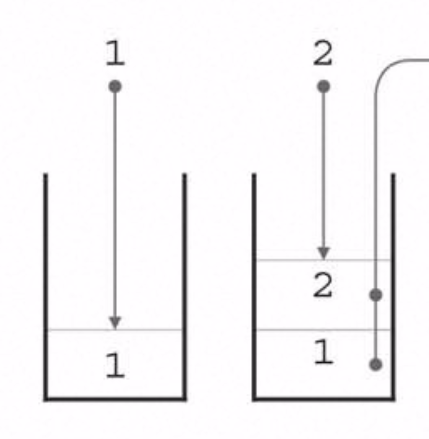
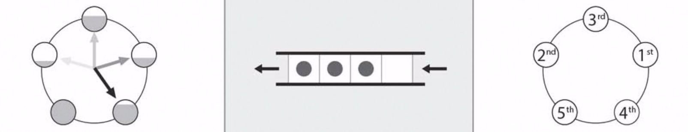

<!-- .slide: data-background-transition: "slide" -->

## アルゴリズム勉強

2015/07/22  
Daiki Arai

---

### 目的

効果的なアルゴリズムを意識することで、以下を実現  
  
1. 引き継ぎ後に（手入れされないことで）バグが生まれるコードをなくす  
2. 後輩からの尊敬を得る  

---

### example

- 10人分のプレイヤーの得点（100点満点）が記録されたデータから、上位3人を得点順に出力  

入力例  
25 36 4 55 71 18 0 71 89 65  
出力例  
89 71 71  

※参考文献：プログラミングコンテスト攻略のためのアルゴリズムとデータ構造（渡部有隆）

---

### solution

1. 3回探索
配列A[10]に格納 → 最大値を出力 → 取り除き再度最大値を探査
2. ソート後に出力
配列A[10]に格納 → 降順ソート  
3. 各特典毎の人数を数える  
得点pを獲得した人数を配列B[p]に記録 → B[100],B[99]...と出力

---

### メリデメ

1. 3回探索
単純だがsortが使えるなら2が簡潔
2. ソート後に出力
ソートの方法次第で早さが変わる？  
3. 各特典毎の人数を数える  
汎用性があるが、場合によってはメモリを多く消費する

---

### Q1

- 0 から INTMAX の数字がRandomに並んでいる。しかし実際にはある整数Nが抜けている(総数はINTMAX - 1)。  
Nを調べなさい。   

メモリ制限: 1GB  
時間制限: なし 

---

### Hint

- 0 to INTMAX-1の配列を持とうとすると、必要なメモリは  
2^31 * 4byte / 1024 / 1024 / 1024 = 8Gbyte

- exの解3のように一つずつ調べていく方法だとメモリ制限に引っかかる。

---

### A1

1. 数字一つを表す方法を、int(4byte)より小さくする
2. 合計値は不変なので、ループの中でSum(合計)だけを保持する  

```
#include <stdio.h>
#include <stdlib.h>
#include <string.h>
#include <limits.h>

int main(void)
{
    FILE *fp;
    char s[INT_MAX];
    int sum_mod = 0; /* 真田さんのアイデアでunsigned long long型を使用せずにできそう */
    int sum_ideal_mod = ((0 + INT_MAX) * (INT_MAX + 1) / 2) % INTMAX;
    fp = fopen("q1.txt", "r");
    while (fgets(s, INT_MAX - 1, fp) != NULL) {
      s[strlen(s) - 1] = '\0';
      sum_mod += atoi( s );
      sum_mod = sum_mod % INT_MAX;
    }
    fclose(fp);
    ans = abs(sum_ideal_mod - sum_mod);
    if (ans == 0) { ans = INT_MAX; }
    printf("ans=%d\n", ans);
    return 0;
}
```

---

## ビット配列

- 2^31 * 1bit / 1024 / 1024 / 1024 = 0.25Gbyte  
例）0−7の数字だったら、以下のように8桁のビット列を定義する。  

```
0 = 00000000
1 = 00000001
2 = 00000010
8 = 10000000
```

---

## Q1解2

- (INTMAX = 8として)特定の値がきたら、そのビット番目の値に1が立っているビット列とORを取る。  

```
・3がきたら
00000000 OR 00000100 = 00000100
・続いて5がきたら
00000100 OR 00100000 = 00100100
```

---

### Q1改

- 0 から INTMAX の数字が**何度か重複して**Randomに並んでいる。しかし実際にはある整数Nが抜けている(総数は重複のため不明)。  
Nを調べなさい。   

→解2でならできる！

---

### Q2

- 0 から INTMAX の数字が**何度か重複して**Randomに並んでいる。しかし実際にはある整数Nが抜けている。  
Nを調べなさい。   

メモリ制限: 1MB  
時間制限: なし 

---

### A2

- 1回ループで完結させようとするとビット配列内に0 to INTMAX全てを常に保持する必要がある(250MB)  
- N回ループとし、一回目のループではビット配列内に0 to INTMAX/Nのみ保持し処理。  
ビット配列内に0があればanswer / 全て1なら次のループへ  

処理時間: N倍  
メモリ消費: 250/N MB

---

### Q3(FX取引などでの最大利益)

- ある通貨の価格を時刻tでRtと表現する。利益 Rj - Ri の最大値は？  
(t=0,1,2...,n - 1)(j > i)  

メモリ制限: 65,536KB  
時間制限: 1sec  
制約: 2 ≦ n ≦ 200,000 ; 1 ≦ Rt ≦ 10^9  

※参考文献：プログラミングコンテスト攻略のためのアルゴリズムとデータ構造（渡部有隆）

---

#### Q3の例

```
入力例1
n=4
5
1
4
2
出力例1
3

入力例1
n=3
4
3
2
出力例1
-1
```

---

#### A3の考え方

```
# 単純だがO(n^2)かかってしまう例
for j 1 to n-1
  for i 1 to j-1
    max = (maxとRj - Ri の大きい方)

# O(n)で終わる例
max = (十分小さな値)
min = (最初の入力)
for j 1 to n-1
  max = (maxとRj - min の大きい方)
  min = (minとRj のうち小さい方)
```

処理時間だけでなく配列も不要なのでメモリ消費も軽減！

---

#### A3解

```
#include <iostream>
#include <algorithm>
using namespace std;
static const int N_MAX = 2000000;

int main()
{
    int R[N_MAX], n;
    cin >> n;
    for ( int i = 0; i < n; i++ ) cin >> R[i];
    
    int max_profit = -1000000;
    int min_r = R[0];
    
    for ( int i = 0; i < n; i++ ) {
        max_profit = max(max_profit, R[i] - min_r);
        min_r = min(min_r, R[i]);
    }
    cout << max_profit << endl;
    
    return 0;
}
```

---

### ソート

種類 | ルール 
--- | --- | ---  
バブルソート | 順番が逆になっている隣接要素がなくなるまで次の処理を繰り返す
挿入ソート | ソート済みの部分を1つずつ増やしていく
選択的ソート | 未ソートの部分から最小の要素を特定し前方へ配置していく
シェルソート | 一定の間隔gだけ離れた要素のみを対象とした挿入ソートを繰り返す
二分木 | 既にソート済みなら中央から2分して位置を特定 ex, B-tree-index

---

### データ構造

- データの集合をルールに従って保持・操作する仕組み

構造 | ルール | 用途 
--- | --- | ---  
Stack | Last In First Out | 一時的なデータ退避
Queue | First In First Out | 順番に処理
Vector | 動的な配列 | 任意の要素にアクセス可能
list | Doubly Linked List | 追加・削除が高速だがアクセスは順番

---

### Stack (=積み重ね)



STLメンバ関数 | 機能 | 計算量
--- | --- | ---  
size() | 要素数返却 | Ο(1) 
top() | 頂点の要素返却| Ο(1) 
pop() | 頂点の要素返却＆削除 | Ο(1) 
push(x) | 要素xを追加 | Ο(1) 
empty() | 空か否か | Ο(1) 

---

### 逆ポーランド記法

- 後置記法、日本語記法（動詞が最後にくるため）とも呼ばれる
- コンパイラではOperationをStack（優先度を比較）して後置記法化し処理

```
a * b + c * d => ab*cd*+  

35*26*+ = ((35*)(26*)+) = 3 * 5 + 2 * 6 = 27  
abc*+d+ = ((a(bc*)+)d+) = a + b * c + d  
ab+cd-* = (a + b) * (c - d)  
```

※参考：「コンパイラの構成と最適化　第2版　中田育男」

---

#### 簡単なコンパイラの仕組み

```
void ex() { 
    float abc, e3;
    abc = e3 * 2.56 + abc / e3;
}
```

Stack

  |   |   |   | /
--- | --- | --- | --- | --- 
  | * |   | + | + 
= | = | = | = | = 

```
abc e3 2.56 * abc e3 / + =
```

---

process | address or priority | variable
:--- | :--- | :---
LoadAddr | 100 | abc
LoadValue | 104 | e3
LoadValue | 200 | 2.56
Operation | 5 | *
LoadValue | 100 | abc
LoadValue | 104 | e3
Operation | 6 | /
Operation | 3 | +
Operation | 1 | =

---

#### Q4(Stack)

- ラウンドロビンスケジューリング：CPUがプロセスを順に処理
- 名前Niと処理時間TiをもつN個のプロセスが順番に一列に並んでいる。各プロセスは最大q msだけ処理し、完了しなければそのプロセスは列の最後尾へ移動し次のプロセスへ。  
これをシュミレートせよ

メモリ制限: 65,536KB  
時間制限: 1sec  
制約: 1 ≦ n ≦ 100,000; 1 ≦ q ≦ 1,000; 1 ≦ Ti ≦ 50,000; 1 ≦ Niの長さ≦ 10;

---

### Queue (=待ち行列)



STLメンバ関数 | 機能 | 計算量
--- | --- | ---  
size() | 要素数返却 | Ο(1) 
front() | 先頭の要素返却| Ο(1) 
pop() | 先頭の要素返却＆削除 | Ο(1) 
push(x) | 要素xを追加 | Ο(1) 
empty() | 空か否か | Ο(1) 

---

#### Q5(Queue)

- ラウンドロビンスケジューリング：CPUがプロセスを順に処理
- 名前Niと処理時間TiをもつN個のプロセスが順番に一列に並んでいる。各プロセスは最大q msだけ処理し、完了しなければそのプロセスは列の最後尾へ移動し次のプロセスへ。  
これをシュミレートせよ

メモリ制限: 65,536KB  
時間制限: 1sec  
制約: 1 ≦ n ≦ 100,000; 1 ≦ q ≦ 1,000; 1 ≦ Ti ≦ 50,000; 1 ≦ Niの長さ≦ 10;

---

#### Q4 ex

```
q=100 
t=0: A(150) - B(80) - C(200) - D(200)
t=100: B(80) - C(200) - D(200) - A(50)
t=180: C(200) - D(200) - A(50)
t=280: D(200) - A(50) - C(100)
```

---

#### Q4入出力例

```
入力例1
5 100
aa 150
bb 80
cc 200
dd 350
ee 20

出力例1
bb 180
ee 400
aa 450
cc 550
dd 800
```

---

#### Q4解

来週

---

### vector / list

STLメンバ関数 | 機能 | 計算量
--- | --- | ---  
size() | 要素数返却 | Ο(1) 
begin() | 先頭のイテレータ返却 | Ο(1) 
end() | 末尾のイテレータ返却 | Ο(1) 
push_front(x) | 先頭に要素x追加(list only) | Ο(1) 
push_back(x) | 最後尾に要素x追加( | Ο(1) 
pop_front() | 先頭要素削除(list only) | Ο(1) 
pop_back() | 最終要素削除 | Ο(1) 
insert(p,x) | pの位置に要素xを追加 | Ο(n) vs Ο(1) 
erase(p) | pの位置に要素を削除 | Ο(n) vs Ο(1)
clear() | 全要素削除 | Ο(n) vs Ο(1) 

